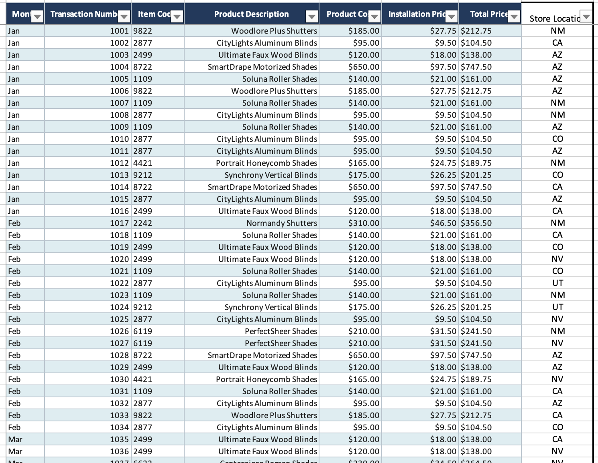
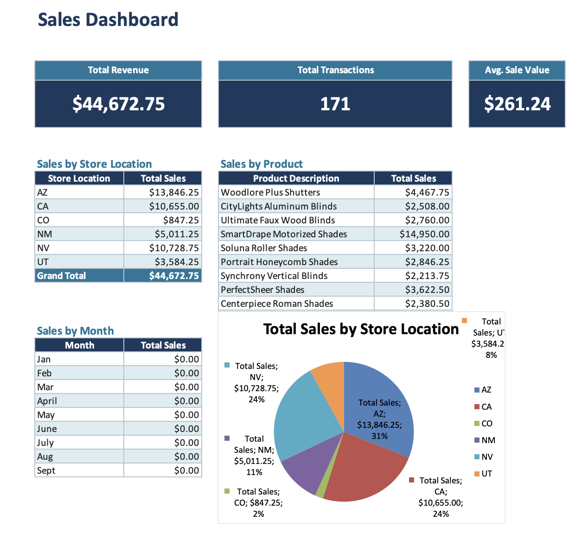

# Norman Sales Dashboard
 
An Excel-based sales tracking and reporting system for Norman window treatment products, built to summarize transactions across multiple store locations using formulas only.
 
## Overview
 
Built an Excel database tracking transactions for Norman product sales, including item code, product description, cost, installation price, and total price across multiple store locations.
 
Built a dashboard summarizing total sales by store location, by month, and by product, with a pie chart breaking down total sales by store location (AZ, CA, CO, NM, NV, UT) — showing AZ and CA as the top-performing markets.
 
## Raw Data
 
171 transactions across 12 months, tracking item code, product description, product cost, installation price, total price, and store location.
 

 
## Dashboard
 
KPI cards for Total Revenue, Total Transactions, and Average Sale Value sit at the top, followed by breakdowns by store location, product line, and month — each fully formula-driven so the dashboard updates automatically as the source data changes.
 

 
> Note: the screenshot above reflects an earlier version of the Month table before a column-reference fix. AZ and CA remain the top-performing markets in the corrected file.
 
## Skills demonstrated
 
- Excel formulas: `IF`, `SUMIF`, `SORT`, `FILTER`
- PivotTable-equivalent summarization using formula-driven tables
- KPI dashboard design
- Bar and pie chart visualization
- Data validation and formula error checking (zero `#REF!`, `#VALUE!`, `#DIV/0!` errors)
## File
 
[`Sales_Database_Dashboard.xlsx`](./Sales_Database_Dashboard.xlsx)
